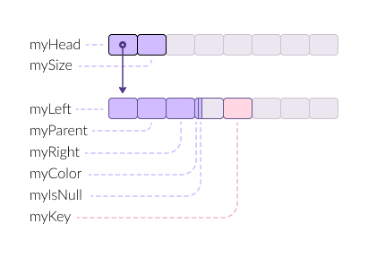

The std::set container in C++ is a sorted associative container that stores
unique elements. Internally, it is typically implemented as a balanced binary
tree (usually a Red-Black Tree). The memory layout of std::set is similar to
that of std::map, but since std::set only stores keys (without associated
values), its node structure is simpler.

## Methods

- operations
- complexity

## Implementation

`std::set` is implemented as a red-black tree -- a balanced binary tree.

```cpp
template<typename T>
class set {
    Node*   myHead;     // Pointer to the parent node
    size_t  mySize;     // Color for Red-Black Tree (true = red, false = black)
}
```

```cpp
template<typename T>
class Node {
    Node*   myLeft;     // Pointer to the left child
    Node*   myParent;   // Pointer to the parent node
    Node*   myRight;    // Pointer to the right child
    char    myColor;    // Color for Red-Black Tree (true = red, false = black)
    char    myIsNil;    // Color for Red-Black Tree (true = red, false = black)
    T       myKey;      // The key element
}
```



`std::set` class:

- `myHead` - a pointer to the head node

- `mySize` - number of keys in the set

`Node` class:

- `myLeft` - A pointer to the left child node.

- `myParent` - A pointer to the parent node.

- `myRight` - A pointer to the right child node.

- `myColor` - red or black color of the node

- `myIsNull` - null node?

- `myKey` - the key element.

### Size

`std::set` allocates 32 bytes per element or more.

`sizeof(x) = 16`

`SizeOf(x) = sizeof(x) + N * (32 + sizeof(T))`
