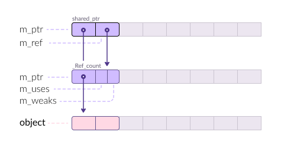
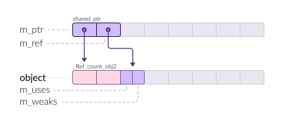

# std::shared_ptr

A `shared pointer` is an object that owns another object through a pointer,
usually obtained via `new`. `shared_ptr` implements semantics of shared
ownership; the last remaining owner of the pointer is responsible for destroying
the object, or otherwise releasing the resources associated with the stored
pointer.

## Examples

_show/hide_

## Implementation

`std::shared_ptr` is ...

```cpp
template<typename T>
class shared_ptr {
private:
  T*                m_ptr;
  _Ref_count_base*  m_rep;
}
```

<https://herbsutter.com/2013/05/29/gotw-89-solution-smart-pointers>

## Details

1. Uses atomic inc / dev. On Windows `_InterlockedIncrement`, which is as simple
   as

   ```
   mov eax, 1;
   mov ebx, ptr;
   lock add [ebx], eax
   ```

   Using `lock` introduces performance penalties due to cache invalidation,
   pipeline stalling (no out-of-order execution), and waiting time to acquire
   the lock.

2. Has a base class, hence virtual functions. Does it penalize performance ?

### Size

- n bytes (64-bit)
- n/2 bytes (32-bit)

### Layout

`_Ref_count_base`.

The derived class tells how the object was created.

Two notable examples:

**new**

`_Ref_count`



**make**

`_Ref_count_obj2`



`make_shared` vs `ptr = new ...`

## See Also

## Reference

`template<class T>`\
`class shared_ptr;`

### construct

- #### ` ` {#unique_ptr}

  ~~`shared_ptr`~~` () noexcept`

  ~~`unique_ptr`~~` (pointer p) noexcept`

  ~~`unique_ptr`~~` (const unique_ptr&) = delete`\
  Disable construction from lvalue.

  ~~`unique_ptr`~~` (unique_ptr&& u) noexcept`

  ~~`unique_ptr`~~` (nullptr_t) noexcept`

  `template<class U, class E>`\
  ~~`unique_ptr`~~` (unique_ptr<U, E>&& u) noexcept`

### assign / copy

- #### ` ` {#operator_assign}

  ~~`operator=`~~` (unique_ptr&& u) noexcept -> unique_ptr&`

  ~~`operator=`~~` (const unique_ptr&) -> unique_ptr& = delete`\
  Disable copy from lvalue.

### observe

- #### ` ` {#get}

  ~~`get`~~` () const noexcept -> pointer`

- #### ` ` {#get_deleter}

  ~~`get_deleter`~~` () const noexcept -> const deleter_type&`

- #### ` ` {#operator_star}

  ~~`operator*`~~` () const -> add_lvalue_reference_t<T>`

- #### ` ` {#operator_arrow_right}

  ~~`operator->`~~` () const noexcept -> pointer`

- #### ` ` {#operator_bool}

  ~~`operator bool`~~` () const noexcept`

### modify

- #### ` ` {#release}

  ~~`release`~~` () noexcept -> pointer`

- #### ` ` {#reset}

  ~~`reset`~~` (pointer p = pointer()) noexcept -> void`

- #### ` ` {#swap}

  ~~`swap`~~` (unique_ptr& u) noexcept -> void`
